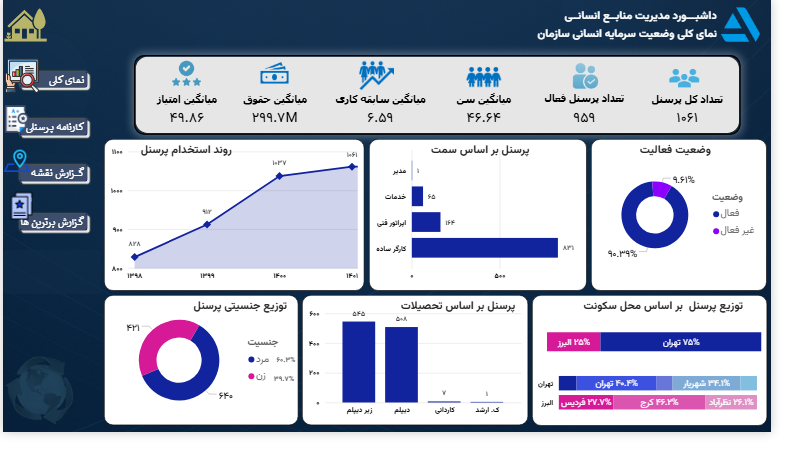
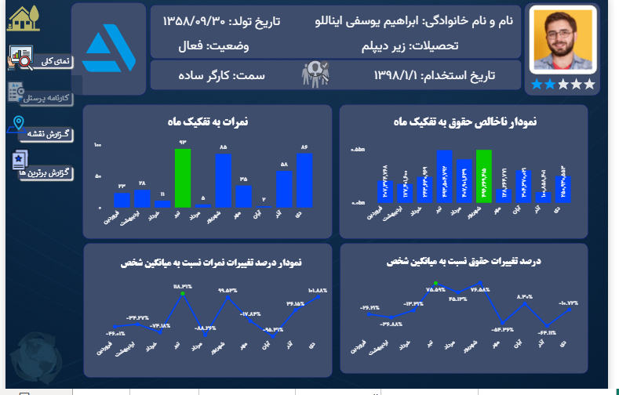
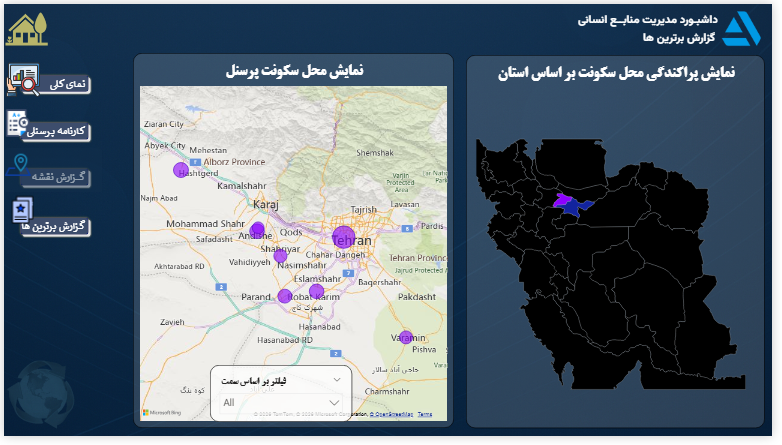
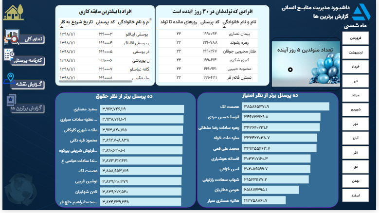
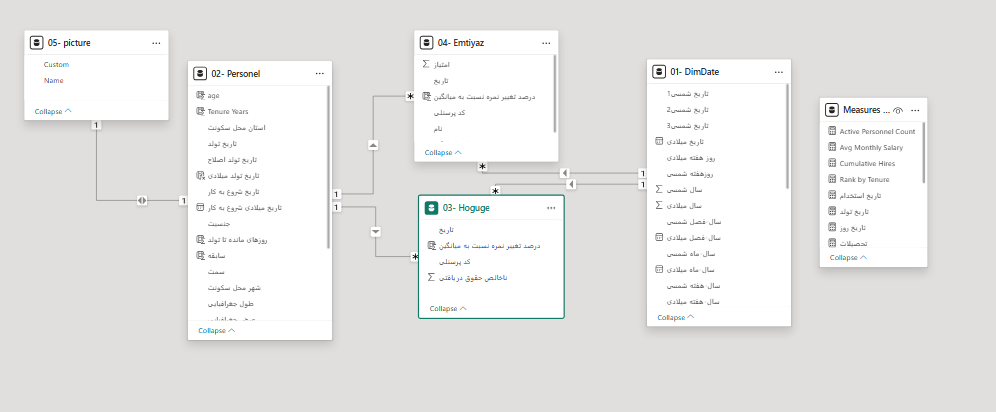

# داشبورد مدیریت منابع انسانی — Power BI

**HR Management Dashboard** — یک پروژه آموزشی Power BI بر پایه داده‌های نمونه و ساختگی، تهیه‌شده با استفاده از محتوای دوره آموزشی مهندس ایرج تبریزی.

> این پروژه آموزشی است و تمام داده‌ها ساختگی هستند. هدف پروژه تمرین مدل‌سازی داده، DAX و طراحی گزارش‌های تعاملی در Power BI است.

داشبورد برای بررسی وضعیت پرسنل، حقوق و دستمزد، عملکرد و پراکندگی جغرافیایی نیروی انسانی طراحی شده است.

## داده‌ها

سه فایل Excel به‌عنوان منبع داده استفاده شده است:

* **اطلاعات پرسنلی:** مشخصات فردی، تحصیلات، سمت، تاریخ استخدام و محل سکونت — 1,062 رکورد
* **حقوق و دستمزد:** حقوق ناخالص ماهانه کارکنان — 10,611 رکورد
* **امتیاز عملکرد:** امتیاز ماهانه کارکنان — 10,611 رکورد

## صفحات داشبورد

### نمای کلی

نمای کلی وضعیت پرسنل شامل KPIهای تعداد کارکنان، پرسنل فعال، میانگین سن و سابقه، حقوق و امتیاز عملکرد، به‌همراه روند استخدام، توزیع جنسیتی و تحصیلی و محل سکونت.

### کارنامه فردی

نمایش حقوق و امتیاز عملکرد ماهانه هر فرد و درصد تغییر نسبت به میانگین شخص، همراه با مشخصات فردی.

### گزارش نقشه

نمایش محل سکونت کارکنان روی نقشه و بررسی پراکندگی جغرافیایی نیروی انسانی.

### گزارش برترین‌ها

نمایش ۱۰ نفر برتر بر اساس حقوق و امتیاز عملکرد، کارکنان دارای بیشترین سابقه و تولدهای پیش‌رو.

## مدل داده

مدل داده شامل جداول پرسنل، حقوق، امتیاز عملکرد، تاریخ و تصاویر کارکنان با روابط تعریف‌شده در Power BI.

## ابزارها و تکنیک‌ها

* **Power BI Desktop:** مدل‌سازی داده، DAX و Power Query
* **مدل‌سازی ابعادی:** جدول تاریخ مشترک با پشتیبانی از تاریخ شمسی و میلادی
* **DAX Measures:** میانگین‌ها، درصد انحراف از میانگین شخص، رتبه‌بندی و شاخص‌های زمانی
* **تحلیل جغرافیایی:** نمایش پراکندگی محل سکونت کارکنان روی نقشه
